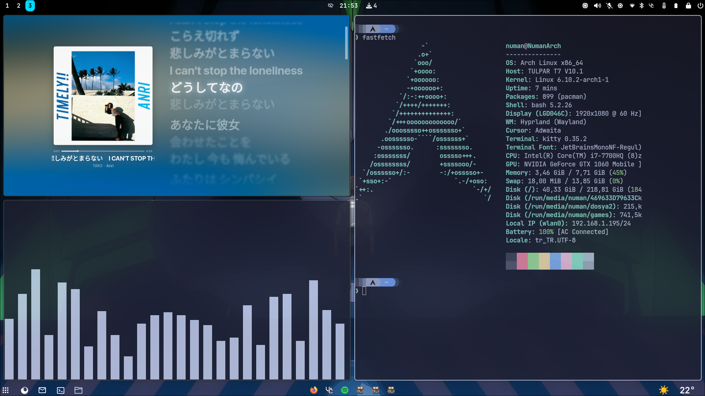

# Emrenin dotfilesi
bir çok yerden parça parça esinlenerek yaptım 
(gelecekteki ben için bazı eksikler olabilir o yüzden bilemem)
**UYARI**: direk dosya değişimi yapmayın farklılıklar sıkıntı çıkarır
Use at your own risk!

# kurulumdan önce yapılması gerekenler
## hyprland açılmaz ise
bu sadece nvidialılar için buradan başla
```
yay -S linux-headers nvidia-dkms qt5-wayland qt5ct libva libva-nvidia-driver-git

```
/etc/mkinitcpio.conf
```
MODULES=(nvidia nvidia_modeset nvidia_uvm nvidia_drm)
```
yeni initramfs görünümü oluştur
```
sudo mkinitcpio --config /etc/mkinitcpio.conf --generate /boot/initramfs-custom.img
```
yeni NVIDIA confiği oluştur
```
echo "options nvidia-drm modeset=1" | sudo tee /etc/modprobe.d/nvidia.conf
```
onayla
```
cat /etc/modprobe.d/nvidia.conf
```
gerilet: 
```
options nvidia-drm modeset=1
```
şimdi yeniden başlat
```
reboot
```
### yay paketleyicisini yükle
Bu paketleri kur
```
sudo pacman -S --needed base-devel git
```
sistem güncelmi değilmi diye teyit et
```
sudo pacman -Syu
```
güncellemeden sonra git deposundan lazım olan dosyayı çek
```
git clone https://aur.archlinux.org/yay.git
```
ana dizine indirdikten sonra yay dosyasına geçiş yap
```
cd yay
```
geçiş yaptıktan sonra paketi buildle
```
makepkg -si
```
adam akıllı inmişmi diye kontrole çek
```
yay -V
```

## yüklenmesi gerekenler
```
yay -S hyprland kitty jq mako waybar-hyprland swww swaylock-effects \
wofi wlogout xdg-desktop-portal-hyprland vesktop swappy grim slurp thunar \
polkit-gnome python-requests pamixer pavucontrol brightnessctl bluez \
bluez-utils blueman waypaper network-manager-applet gvfs thunar-archive-plugin \
file-roller spicetify-cli btop pacman-contrib starship ttf-jetbrains-mono-nerd \
noto-fonts-emoji spotify-launcher lxappearance xfce4-settings sddm-git sddm-sugar-candy-git
```
ayar yapılması gerekenleri yap 

sonra config dosyalarını geçir

### a little rice


